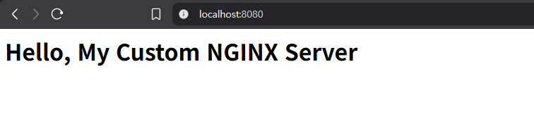
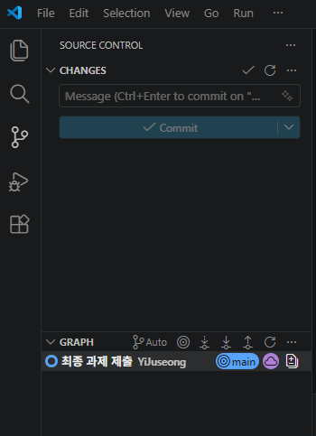

# 과제: 개발 워크스테이션 구축 및 Docker 활용

## 0. 프로젝트 개요 및 환경
* **프로젝트 개요:** 본 프로젝트는 Docker 컨테이너 기반의 웹 서버 개발 워크스테이션을 구축하고 Git/GitHub와 연동하여 버전 관리 및 협업 환경을 구성하는 것을 목표로 합니다.
* **실행 환경:** * OS: Windows 10/11 (Git Bash 터미널 환경)
  * Docker 버전: Docker version 29.3.1
  * Git 버전: git version 2.53.0.windows.2
* **수행 항목 체크리스트:**
  - [x] 터미널 기본 조작 및 권한 제어 실습
  - [x] Docker 설치 점검 및 기본 컨테이너 운영
  - [x] Dockerfile 기반 웹 서버 커스텀 이미지 빌드
  - [x] 포트 매핑을 통한 브라우저 접속 증명
  - [x] 바인드 마운트 및 Docker 볼륨 영속성 검증
  - [x] Git/GitHub 저장소 연동

## 1. 터미널 조작 로그 기록
터미널에서 디렉토리/파일 생성, 복사, 이동, 삭제 등의 기본 조작을 수행했습니다.

```bash
# 1. 현재 위치 확인
$ pwd
C:\Users\qlcke\docker-assignment

# 2. 실습용 디렉토리 생성 및 이동
$mkdir terminal_test$ cd terminal_test

# 3. 빈 파일 생성 및 목록 확인 (숨김 파일 포함)
$touch empty_file.txt$ ls -al
total 28
drwxr-xr-x 1 qlcke 197609 0 Mar 31 21:42 ./
drwxr-xr-x 1 qlcke 197609 0 Mar 31 21:16 ../
-rw-r--r-- 1 qlcke 197609 0 Mar 31 21:21 README.md
-rw-r--r-- 1 qlcke 197609 0 Mar 31 21:42 empty_file.txt
drwxr-xr-x 1 qlcke 197609 0 Mar 31 21:30 images/
drwxr-xr-x 1 qlcke 197609 0 Mar 31 21:37 terminal_test/

# 4. 파일 내용 확인 (빈 파일이므로 아무것도 출력되지 않음)
$ cat empty_file.txt

# 5. 파일에 내용 추가 후 다시 확인 (echo 활용)
$echo "Hello OrbStack" > empty_file.txt$ cat empty_file.txt
Hello OrbStack

# 6. 파일 복사 및 이동/이름 변경
$cp empty_file.txt copied_file.txt$ mv copied_file.txt renamed_file.txt
$ ls -al
total 30
drwxr-xr-x 1 qlcke 197609  0 Mar 31 21:44 ./
drwxr-xr-x 1 qlcke 197609  0 Mar 31 21:16 ../
-rw-r--r-- 1 qlcke 197609  0 Mar 31 21:21 README.md
-rw-r--r-- 1 qlcke 197609 15 Mar 31 21:44 empty_file.txt
drwxr-xr-x 1 qlcke 197609  0 Mar 31 21:30 images/
-rw-r--r-- 1 qlcke 197609 15 Mar 31 21:44 renamed_file.txt
drwxr-xr-x 1 qlcke 197609  0 Mar 31 21:37 terminal_test/

# 7. 파일 삭제 및 최종 목록 확인
$rm empty_file.txt$ ls -al
total 29
drwxr-xr-x 1 qlcke 197609  0 Mar 31 21:45 ./
drwxr-xr-x 1 qlcke 197609  0 Mar 31 21:16 ../
-rw-r--r-- 1 qlcke 197609  0 Mar 31 21:21 README.md
drwxr-xr-x 1 qlcke 197609  0 Mar 31 21:30 images/
-rw-r--r-- 1 qlcke 197609 15 Mar 31 21:44 renamed_file.txt
drwxr-xr-x 1 qlcke 197609  0 Mar 31 21:37 terminal_test/
```
## 2. 권한 실습 및 증거 기록
파일 1개, 디렉토리 1개에 대해 권한 확인 및 변경을 수행하고 비교했습니다.

```bash
# 1. 실습용 파일과 디렉토리 준비
$touch perm_file.txt$ mkdir perm_dir

# 2. 권한 변경 전 확인
$ ls -al | grep perm_
drwxr-xr-x 1 qlcke 197609  0 Mar 31 21:46 perm_dir/
-rw-r--r-- 1 qlcke 197609  0 Mar 31 21:46 perm_file.txt

# 3. 권한 변경 수행
$chmod 700 perm_file.txt
$ chmod 777 perm_dir

# 4. 권한 변경 후 비교 확인
$ ls -al | grep perm_
drwxrwxrwx 1 qlcke 197609  0 Mar 31 21:46 perm_dir/
-rwx------ 1 qlcke 197609  0 Mar 31 21:46 perm_file.txt
```
## 3. Docker 설치 및 기본 점검
Docker 버전과 데몬이 정상적으로 동작하는지 확인했습니다.

```bash
# 1. Docker 버전 확인
$ docker --version
Docker version 29.3.1, build c2be9cc

# 2. Docker 데몬 동작 여부 확인 
$ docker info
Client:
 Version:    29.3.1
 Context:    desktop-linux
 Debug Mode: false
 Plugins:
  agent: Docker AI Agent Runner (Docker Inc.)
    Version:  v1.34.0
```
## 4. Docker 기본 운영 명령 수행

```bash
# 1. 현재 다운로드된 도커 이미지 목록 확인
$ docker images
IMAGE           ID             DISK USAGE   CONTENT SIZE   EXTRA
ubuntu:latest   186072bba1b2        119MB         31.7MB    U

# 2. 실행 중인 컨테이너 목록 확인
$ docker ps
CONTAINER ID   IMAGE     COMMAND       CREATED             STATUS             PORTS     NAMES
5d26554c79c1   ubuntu    "/bin/bash"   About an hour ago   Up About an hour
my-linux

# 3. 종료된 것을 포함한 모든 컨테이너 목록 확인
$ docker ps -a
CONTAINER ID   IMAGE     COMMAND       CREATED             STATUS             PORTS     NAMES
5d26554c79c1   ubuntu    "/bin/bash"   About an hour ago   Up About an hour
my-linux

# 4. 리소스 확인 
$ docker stats --no-stream
CONTAINER ID   NAME       CPU %     MEM USAGE / LIMIT    MEM %     NET I/O         BLOCK I/O   PIDS
5d26554c79c1   my-linux   0.00%     2.02MiB / 7.675GiB   0.03%     1.17kB / 126B   0B / 0B     1
```

## 5. 컨테이너 실행 실습
Docker가 컨테이너를 정상적으로 생성하고 실행할 수 있는지 테스트하고 우분투 컨테이너 내부로 진입해 보았습니다.

```bash
$ docker run hello-world
Hello from Docker!
This message shows that your installation appears to be working correctly.
```

```bash
# ubuntu 컨테이너 내부(bash)로 진입 및 명령어 수행
$ docker run -it ubuntu bash
root@abcdef12345:/# ls
bin   dev  home  lib64  mnt  proc  run   srv  tmp  var
boot  etc  lib   media  opt  root  sbin  sys  usr

root@abcdef12345:/# echo "Hello Ubuntu Container"
Hello Ubuntu Container
root@abcdef12345:/# exit
```
컨테이너 종료/유지(attach/exec) 차이점 관찰 결과

attach: 컨테이너의 메인 프로세스(PID 1)에 직접 접속하는 방식입니다. 여기서 exit 명령어로 빠져나오면 메인 프로세스가 종료되므로 컨테이너 자체도 함께 종료(Stop)됩니다.

exec: 이미 실행 중인 컨테이너에 새로운 프로세스를 추가로 실행하여 접속하는 방식입니다. exit를 통해 빠져나오더라도 원래 메인 프로세스는 영향을 받지 않으므로 컨테이너가 계속 실행(Up) 상태를 유지합니다.

## 6. 기존 Dockerfile 기반 커스텀 이미지 제작
(A) 웹 서버 베이스 이미지를 활용한 커스텀 이미지 제작을 선택하여 진행했습니다.

선택한 베이스 이미지: nginx:latest (공식 NGINX 웹 서버 이미지)

커스텀 포인트 목적: NGINX에서 기본 제공하는 시작 페이지 대신, 직접 작성한 정적 콘텐츠(index.html)가 서비스되도록 설정 파일을 교체했습니다.

```bash
$ cat Dockerfile
FROM nginx:latest
COPY index.html /usr/share/nginx/html/index.html

$ docker build -t my-custom-nginx .
[+] Building 8.0s (7/7) FINISHED                                   docker:desktop-linux
 => exporting to image                                                             0.2s
 => => naming to docker.io/library/my-custom-nginx:latest                          0.0s
```
빌드한 이미지를 기반으로 웹 서버 컨테이너를 실행했습니다. 호스트의 8080 포트와 컨테이너의 80 포트를 매핑(-p 8080:80)했습니다.

```bash
$ docker run -d -p 8080:80 --name my-web-server my-custom-nginx
13d0af87971befe1462985221aceae38a3ad2fc74d6416989a9610b74e4dff11

$ docker ps
CONTAINER ID   IMAGE             COMMAND                   CREATED             STATUS             PORTS                                     NAMES
13d0af87971b   my-custom-nginx   "/docker-entrypoint.…"   25 seconds ago      Up 25 seconds      0.0.0.0:8080->80/tcp, [::]:8080->80/tcp   my-web-server
```
포트 매핑 접속 증거


## 7. 데이터 영속성 검증 (바인드 마운트 및 도커 볼륨)
1) 바인드 마운트 반영 검증
호스트의 디렉토리를 컨테이너와 연결하여, 호스트 디렉토리의 변경 전/후 상태를 비교했습니다.

```bash
$mkdir bind_test$ echo "Hello from Host" > bind_test/host.txt
$ ls -al bind_test
-rw-r--r-- 1 qlcke 197609 16 Mar 31 22:24 host.txt

$ MSYS_NO_PATHCONV=1 docker run --rm -v "$(pwd)/bind_test:/app" ubuntu bash -c "echo 'Hello from Container' > /app/container.txt"

$ ls -al bind_test
-rw-r--r-- 1 qlcke 197609 21 Mar 31 22:31 container.txt
-rw-r--r-- 1 qlcke 197609 16 Mar 31 22:24 host.txt
```
2) Docker 볼륨 영속성 검증
컨테이너를 삭제하더라도 볼륨에 저장된 데이터는 안전하게 유지됨을 증명했습니다.

```bash
# 1. 볼륨 생성
$ docker volume create my-data-vol

# 2. 컨테이너 실행 및 볼륨 연결 
$ docker run -d --name vol-test -v my-data-vol://data ubuntu sleep 1000

# 3. 컨테이너 내부에 데이터 기록 및 확인 
$docker exec vol-test bash -c "echo 'This data is persistent!' > //data/survivor.txt"$ docker exec vol-test cat //data/survivor.txt
This data is persistent

# 4. 컨테이너 강제 삭제
$ docker rm -f vol-test

# 5. 새로운 컨테이너에 기존 볼륨 연결 후 데이터 보존 확인
$ docker run --rm -v my-data-vol://data ubuntu cat //data/survivor.txt
This data is persistent
```

## 8. 트러블슈팅

트러블슈팅 1: 컨테이너 이름 중복 (Conflict) 오류
[문제 발생]: docker run 명령어로 웹 서버 컨테이너를 실행할 때 Error response from daemon: Conflict. The container name "/my-web-server" is already in use... 에러 발생.

[원인 가설]: 이전에 실습하며 동일한 이름(my-web-server)으로 생성했던 컨테이너가 삭제되지 않고 남아있어 이름이 중복되었을 것이다.

[확인]: docker ps -a 명령어로 기존 컨테이너가 존재하는 것을 확인.

[해결/대안]: docker rm -f my-web-server 명령어로 기존 컨테이너를 삭제한 뒤 다시 실행하여 해결함.    

트러블슈팅 2: 다중 명령어 입력 및 경로 변환 오류
[문제 발생]: 바인드 마운트 실습 시 파일 생성 오류(No such file or directory) 및 //app 경로 인식 오류 발생.

[원인 가설]: 윈도우 Git Bash 환경에서 리눅스식 절대 경로(/app)를 윈도우 경로로 자동 변환하려고 시도하면서 발생한 문제일 것이다.

[해결/대안]: 명령어 앞에 MSYS_NO_PATHCONV=1 환경 변수를 추가하여 쉘의 경로 자동 변환 기능을 차단함으로써 정상적으로 마운트 및 파일 생성을 완료함.

## 9. Git 설정 및 GitHub 연동

**[Git 사용자 정보 및 기본 브랜치 설정 완료]**
터미널에서 Git 전역 설정을 완료하고 `git config --list` 명령어로 확인했습니다.

```bash
$ git config --global --list
filter.lfs.clean=git-lfs clean -- %f
filter.lfs.smudge=git-lfs smudge -- %f
filter.lfs.process=git-lfs filter-process
filter.lfs.required=true
user.name=YiJuseong
user.email=qlckem@naver.com
gui.recentrepo=C:/Users/qlcke/projects/roomify-backend-poc/android project
init.defaultbranch=main
```
[VSCode GitHub 연동 증거]
VSCode의 소스 제어 기능을 활용하여 로컬 저장소를 초기화하고, GitHub 계정 로그인 및 Public Repository 연동을 완료했습니다.



## 10. 보안 및 개인정보 보호

본 기술 문서와 첨부된 모든 스크린샷, 로그 내역을 검토하여 비밀번호, 개인키, 토큰 등 민감한 개인정보가 노출되지 않도록 마스킹 및 제외 처리를 완료했습니다.

GitHub 저장소 역시 Public 공개 전 민감 파일(보안 키 등)이 포함되지 않았음을 확인했습니다.

## 11. 심층 인터뷰 및 핵심 기술 원리 설계

#### 1) 동작 구조 설계: 프로젝트 디렉토리 구조 구성 기준
프로젝트의 유지보수성과 가독성을 높이기 위해 목적별로 디렉토리를 분리했습니다.
* **루트 디렉토리 (`/`)**: 빌드와 실행에 직결되는 핵심 파일(`Dockerfile`, `README.md`, `index.html`)을 배치하여 작업 접근성을 높였습니다.
* **정적 자원 분리 (`images/`)**: 마크다운 문서에 삽입될 캡처 이미지들을 별도 폴더로 분리하여 루트 경로가 지저분해지는 것을 방지했습니다.
* **테스트 격리 (`bind_test/`, `terminal_test/` 등)**: 마운트 테스트나 권한 실습 등 일회성으로 생성되는 파일들을 전용 디렉토리에 격리하여, 실제 웹 서버 구동에 필요한 핵심 소스 코드가 오염되지 않도록 구조화했습니다.

#### 2) 동작 구조 설계: 포트 및 볼륨 설정의 재현성 확보 방식
멱등성(Idempotency)과 재현성을 보장하기 위해, 마우스 클릭(GUI)에 의존하지 않고 모든 환경 설정을 **터미널 명령어(CLI) 기반으로 명시**했습니다. 
`-p` (포트 매핑)와 `-v` (볼륨 마운트) 옵션을 사용하여 호스트와 컨테이너 간의 연결 상태를 스크립트화하였으며, `README.md`에 실행 순서대로 로그를 기록했습니다. 이를 통해 다른 개발자가 본 문서의 명령어를 복사/붙여넣기만 해도 100% 동일한 포트 및 데이터 보존 환경이 구축되도록 재현 가능하게 설계했습니다.

#### 3) 핵심 기술 원리: 이미지와 컨테이너의 차이점 (빌드/실행/변경 관점)
* **빌드(Build) 관점**: 이미지는 `Dockerfile`을 통해 애플리케이션 실행에 필요한 코드, 라이브러리, 환경 설정을 모아 놓은 **'정적인 템플릿(설계도)'**을 만드는 과정입니다. 한 번 빌드되면 읽기 전용(Read-only) 상태가 됩니다.
* **실행(Run) 관점**: 컨테이너는 이 정적인 이미지를 기반으로 메모리에 적재되어 실제 동작하는 **'동적인 프로세스'**입니다. 하나의 이미지로 여러 개의 독립적인 컨테이너를 실행할 수 있습니다.
* **변경(Change) 관점**: 실행 중인 컨테이너 내부에서 파일을 수정하더라도 원본 이미지는 절대 변경되지 않습니다. 컨테이너 최상단에 쓰기 가능 계층(Write layer)이 임시로 생성되어 변경 사항을 저장하며, 컨테이너가 삭제되면 이 변경 사항도 함께 소멸합니다.

#### 4) 핵심 기술 원리: 컨테이너 포트 직접 접속 불가 이유와 포트 매핑의 필요성
컨테이너는 호스트 OS와 격리된 자체적인 네트워크 네임스페이스와 내부 사설 IP(예: `172.x.x.x` 대역)를 가집니다. 외부 사용자나 브라우저는 호스트 PC의 외부 IP 주소만 알 수 있을 뿐, 격리된 가상망 안쪽에 있는 컨테이너의 내부 IP로는 라우팅이 불가능하여 직접 접속할 수 없습니다. 
따라서 외부 트래픽이 호스트의 특정 포트(예: 8080)로 들어왔을 때, 이를 컨테이너 내부의 특정 포트(예: 80)로 전달해 주는 **포트 매핑(Port Forwarding/Mapping)** 과정이 웹 서비스 노출을 위해 반드시 필요합니다.

#### 5) 핵심 기술 원리: 절대 경로와 상대 경로의 선택 기준
* **절대 경로**: 시스템의 루트(`/` 또는 `C:\`)부터 시작하는 변하지 않는 경로입니다. 위치가 고정적이어야 하는 시스템 설정 파일 지정, Dockerfile 내부의 작업 공간(`WORKDIR`) 설정, 혹은 바인드 마운트 시 호스트의 명확한 물리적 위치를 강제해야 할 때 선택합니다.
* **상대 경로**: 현재 작업 중인 디렉토리(`.`)를 기준으로 한 경로입니다. 소스 코드 내부의 파일 참조나 `README.md`에서 `./images/`를 불러올 때처럼, 프로젝트 폴더가 다른 컴퓨터나 다른 경로로 이동하더라도 내부 구조만 동일하면 정상 동작해야 하는 유연한 상황에서 선택합니다.

#### 6) 핵심 기술 원리: 파일 권한 숫자 표기 결정 규칙 (예: 755, 644)
리눅스의 파일 권한은 소유자(Owner), 그룹(Group), 기타 사용자(Others) 순서로 세 자리 숫자로 표현되며, 각 숫자는 **읽기(Read=4), 쓰기(Write=2), 실행(Execute=1)** 값의 합으로 결정됩니다.
* **755**: 소유자 `7(4+2+1, rwx)`, 그룹 `5(4+1, r-x)`, 기타 `5(4+1, r-x)`를 의미하며, 소유자만 모든 권한을 갖고 나머지는 읽고 실행만 가능한 디렉토리나 실행 파일에 주로 사용합니다.
* **644**: 소유자 `6(4+2, rw-)`, 그룹 `4(r--)`, 기타 `4(r--)`를 의미하며, 실행할 필요가 없는 일반적인 텍스트 문서나 소스 코드 파일에 주로 사용합니다.

#### 7) 심층 인터뷰: "호스트 포트 사용 중" 포트 매핑 실패 시 진단 순서
해당 에러 발생 시 다음과 같은 순서로 원인을 진단하고 해결합니다.
1. **도커 컨테이너 충돌 확인**: `docker ps` 명령어로 현재 실행 중인 다른 컨테이너가 해당 호스트 포트를 이미 점유하고 있는지 확인하고, 불필요하다면 종료(`docker stop`)합니다.
2. **호스트 점유 프로세스 확인**: 터미널에서 `netstat -ano | findstr "포트번호"` (Windows) 또는 `lsof -i :포트번호` (Mac/Linux)를 입력하여 포트를 선점한 프로세스(PID)를 추적합니다.
3. **해결 방안 적용**: 해당 프로세스가 불필요하다면 강제 종료(kill)하여 포트를 확보하고, 호스트 OS 필수 서비스라면 `docker run` 시 호스트 쪽 매핑 포트를 다른 빈 포트 번호로 변경(예: `-p 8081:80`)하여 실행합니다.

#### 8) 심층 인터뷰: 컨테이너 삭제 후 데이터 유실 방지 대안
컨테이너는 본질적으로 상태를 저장하지 않는 임시적(Stateless)인 특성을 가집니다. 컨테이너 내부의 쓰기 가능 계층(Write layer)은 컨테이너가 파괴될 때 함께 소멸하므로, DB나 로그 파일 등의 중요 데이터가 유실되는 위험이 있습니다.
이를 방지하고 **데이터 영속성(Persistence)**을 확보하기 위한 대안으로, 컨테이너 내부의 특정 경로를 호스트 OS의 파일 시스템과 연결하는 **바인드 마운트(Bind Mount)** 방식을 사용하거나, 도커 데몬이 자체적으로 안전하게 관리해 주는 **도커 볼륨(Docker Volume)**을 생성하여 연결해야 합니다.